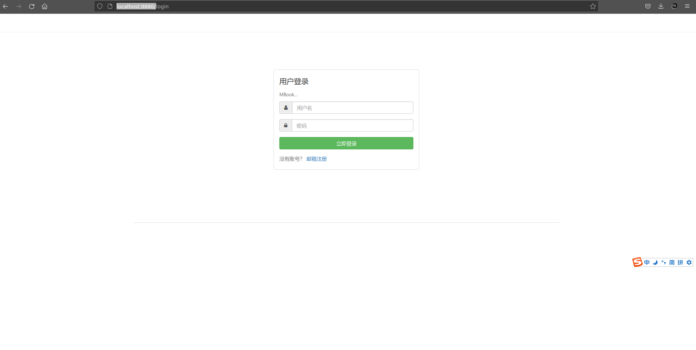
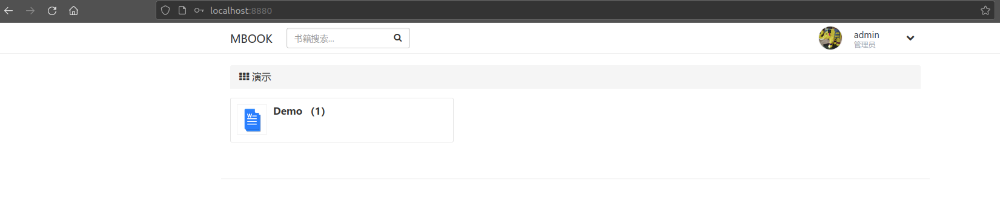
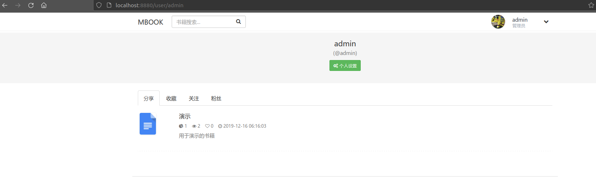

# mbook  

mbook是基于[BookStack](https://github.com/TruthHun/BookStack)进行重构和开发的。这两个项目最终来源于[MinDoc](https://github.com/lifei6671/mindoc)。
在开发的过程中，根据需求做了功能裁减，然后进行了大量架构重构和性能优化，对其中很大一部分代码的逻辑实现部分进行了改写，同时也对部分表结构进行了调整。  

## 涉及技术栈  

- Go  
- Beego框架  
- MySQL数据库和ORM  
- 前端  

## 编译运行  

1.将项目放在GOPATH/src下，使得目录结构最终如下面的样子  
```
$ tree -L 1
.
├── common
├── conf
├── controllers
├── doc
├── go.mod
├── go.sum
├── LICENSE
├── main.go
├── mbook
├── mbook.sql
├── mbook_useraction.sql
├── models
├── README.md
├── res
├── routers
├── static
├── store
├── sysinit
├── tests
├── utils
└── views
```

2.命令行到代码目录下  
```
cd $GOPATH/src/ mbook
```

3.将mbook.sql和mbook_useraction.sql导入数据库  

4.运行服务  
```
bee run
```

5.在`http://localhost:8880`下登录  
  

默认管理员用户名:admin , 密码:135246

6.登录成功后跳转  

  

个人页面  

  