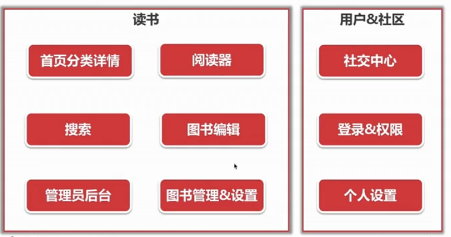
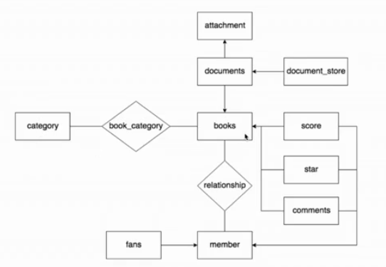

<!--
 * @Description: 
 * @Author: neozhang
 * @Date: 2022-01-01 11:54:10
 * @LastEditors: neozhang
 * @LastEditTime: 2022-01-01 11:59:56
-->
  

## 首页&分类&详情  

- 分类首页  
- 分类详情  
- 图书详情  

## 阅读器  

- 章节&内容  
- 章节搜索  

## 图书编辑  

- 编辑图书属性  
- 章节内容编辑  
- 创建&删除章节  
- 上传&删除附件  

## 搜索  

- 创建索引  
- 内容搜索  

## 图书管理设置  

- “我的”图书  
- 创建图书  
- 图书设置  

## 管理员后台  

- 站点设置  
- 分类设置  

## 社交中心  

- 个人主页  
- 关注  
- 评论&评分  
- 粉丝  
- 收藏  

## 登录&权限  

- 注册  
- 登录&登出  
- 权限管理  

  